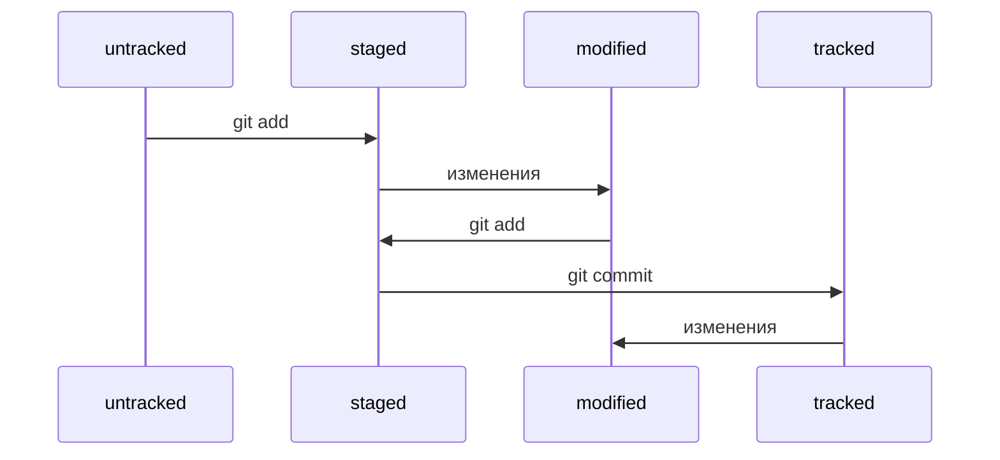

# Шпаргалка по использованию Git
## Навигация по коммитам. Статусы файлов
### Хэш
* Git преобразует информацию о коммитах с помощью алгоритма SHA-1. Затем для каждого коммита рассчитывает уникальный идентификатор — хеш.
* Хеш — основной идентификатор коммита. Он показывает автора, дату и содержимое закоммиченных файлов.
* Все хеши, а также таблицу соответствий `хеш → информация` о коммите Git хранит в папке `.git`.
### Лог
* Чтобы увидеть список коммитов, используется команда `git log`
* Чтобы вызвать сокращенный лог, используется команда `git log --oneline`.
* В сокращённом логе выводятся сокращённые хеши — их можно использовать точно так же, как и полные.
### Head
* В числе прочих файлов в папке `.git` есть служебный файл `HEAD`. Он указывает на самый свежий коммит.
* Вместо хеша последнего коммита можно написать слово `HEAD` — Git вас поймёт.
### Статусы файлов
* Статусом `untracked` помечается файл, о котором Git знает, но не следит за его изменениями. Этот статус — противоположность `tracked`, в который попадают все файлы, отслеживаемые Git.
* Файл переходит в статус `staged` после выполнения `git add`. То есть `modified` + `get` = `staged`
* Статус `modified` означает, что файл был изменён.
* Большинство файлов в проектах «шагает» по следующему циклу: __*изменён*__ → **_добавлен в список на коммит_** → ***закоммичен*** → ___изменён___ → и так далее.

Типичный жизненный цикл файла в Git

### Оформление сообщений к коммитам
Сообщения ценятся, когда они:
1. Легко читаются
2. Информативные
3. Все оформлены в одном стиле.
